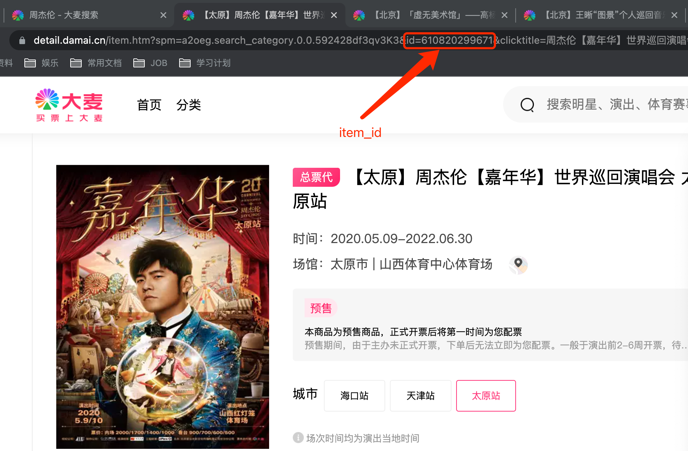

# 大麦抢票脚本 V2.1
更新
- 增加选座购买，暂时只支持抢购指定价格下的座位，且暂不支持连坐购买。

# 大麦抢票脚本 V2.0
在学习到接口相关知识后，决定改造之前的脚本。

## 功能介绍
之前的版本通过按钮操作，还要等待页面元素加载，效率低下。
此版本仅需登录时用到页面，通过selenium打开页面进行登录。其余操作均通过requests进行请求。

ps: 暂不支持选座购买。

其流程图如下:


## 准备工作
### 1. 配置环境

1.1 安装所需要的环境
```shell
pip install -r requirements.txt
```

1.2 需要下载与系统安装对应的ChromeDriver驱动并配置(也可以改用其他浏览器驱动)，

下载地址: http://chromedriver.storage.googleapis.com/index.html

1.3 配置驱动路径，默认在项目根目录下。

例如：windows系统下，则重命名下载的chromedriver，将其重命名为chromedriver_windows
```python
def account_login():
    if platform.system().lower() == 'linux':
        chromedriver = os.path.join(os.getcwd(), 'chromedriver_linux')
    elif platform.system().lower() == 'windows':
        chromedriver = os.path.join(os.getcwd(), 'chromedriver_windows')
    else:
        chromedriver = os.path.join(os.getcwd(), 'chromedriver_mac')
```

### 2. 运行
2.1 若采取账号方式，修改代码中下面的信息，进行抢票。

item_id根据地区来确定,每一个城市对应不同的item_id。选择相应地区后将箭头指向的item_id填写到函数内。
```text
def __init__(self):
    ...
    # 若选择账号登录方式，则需要填写
    self.login_id: str = 'account'          # 大麦网登录账户名
    self.login_password: str = 'password'   # 大麦网登录密码
    # 以下为抢票必须的参数
    self.item_id: int = 610820299671        # 商品id
    self.viewer: list = ['viewer1']         # 在大麦网已填写的观影人
    self.buy_nums: int = 1                  # 购买影票数量, 需与观影人数量一致
    self.ticket_price: int = 180            # 购买指定票价
```


2.2 运行

初次登陆没有cookies，默认登录方式为账号密码登录方式，可改成其他方式进行登录，如扫码或短信登录。
```shell
# 默认登录方式
python Automatic_ticket_purchase.py
# 指定其他方式登录
python Automatic_ticket_purchase.py --mode qr
```


免责声明：详见MIT License，此仓库仅用于个人参考学习，但如他人用本仓库代码用于商业用途(鄙视黄牛)，侵犯到大麦网利益等，本人不承担任何责任。